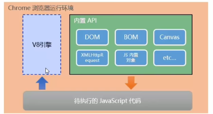
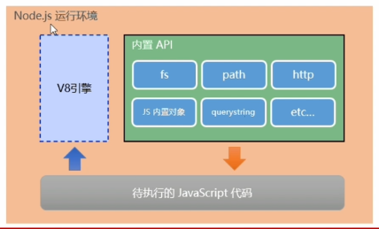

## 浏览器中的JavaScript
1. ECMAScript
2. WebAPI（BOM，DOM，AJAX...）

## 为什么JavaScript可以在浏览器中运行？
1. 由于JavaScript解析引擎
2. 不同浏览器使用不同的JavaScript引擎（Chrome:V8, Firefox:OdinMonkey, Safari: JSCode...）

## 为什么JavaScript可以操作DOM和BOM？
1. 每个浏览器内置了DOM和BOM的API，所以浏览器中JavaScript才可以调用她们

## JavaScript运行环境
1. V8引擎负责解析和执行JavaScript代码
2. 内置API是由运行环境提供的特殊接口，只能在所属的运行环境中被调用


## Node环境
基于Node环境，JavaScript可以做服务端开发

## JavaScript的运行环境
1. 浏览器是JavaScript的前端运行环境
2. Node是JavaScript的后端运行环境
3. Node中无法调用DOM和BOM等浏览器内置API

## Node
Node.js® is an open-source, cross-platform JavaScript runtime environment.

Node是一个基于Chrome V8引擎的JavaScript运行环境。

## Node运行环境


## Node可以做什么
1. Node作为JavaScript的运行环境，仅仅提供了基础的功能和API
2. 但是，基于Node这些基础，强大的工具和框架层出不穷
   【Express可以构建Web应用，
     Electron可以构建跨平台的桌面应用，
     restify可以快速构建API接口项目，
     读写操作数据库，
     命令行工具...】

## Node学习路径
1. JavaScript的路径：ECMAScript -> 浏览器内置API（DOM+BOM） -> 第三方库（jQuery，art-template...）
2. Node.js的路径：ECMAScript -> Node内置API（fd，path，http等） -> 第三方API模块（express，mysql...）

## 安装
https://nodejs.org/en

v16.17.0 (my)

## 命令行Node运行JavaScript代码
```shell
node \js文件路径
```
